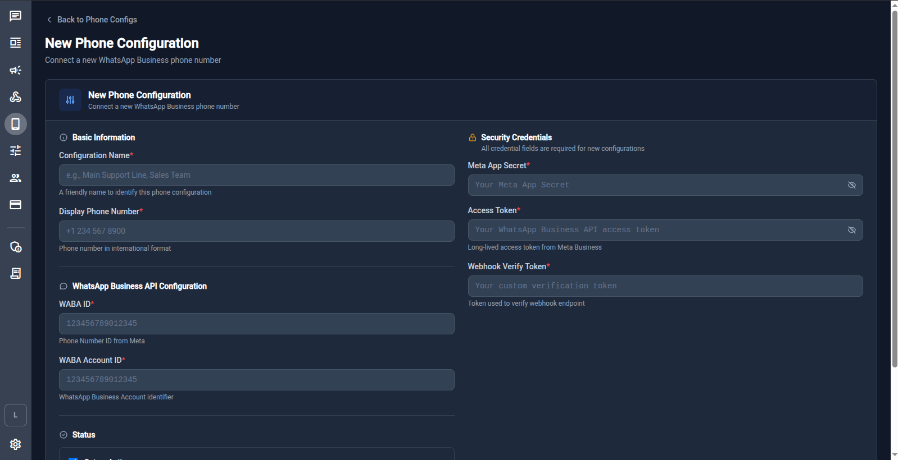

# 📱 Phone Number Configuration

In v0.2.x, WhatsApp phone numbers are configured **entirely through the UI** — no environment variables required. Each workspace can have multiple phone numbers, each with its own credentials.

## Accessing Phone Configs

Navigate to **Phone Configs** from the sidebar (phone icon) or go directly to `/phone-configs`.

To add a new phone number, click **New Phone Config** or navigate to `/phone-configs/new`.

## Fields

### Basic Information

| Field                  | Description                                                                           |
| ---------------------- | ------------------------------------------------------------------------------------- |
| **Configuration Name** | A friendly name to identify this phone config (e.g. "Main Support Line", "Sales Team") |
| **Display Phone Number** | The phone number in international format (e.g. `+1 234 567 8900`)                  |

### WhatsApp Business API Configuration

| Field               | Description                                                                    |
| ------------------- | ------------------------------------------------------------------------------ |
| **WABA ID**         | Phone Number ID from Meta (not the WABA account ID). See [Getting Meta Credentials](./meta-setup.md). |
| **WABA Account ID** | WhatsApp Business Account identifier. See [Getting Meta Credentials](./meta-setup.md). |

### Security Credentials

| Field                    | Description                                                                           |
| ------------------------ | ------------------------------------------------------------------------------------- |
| **Meta App Secret**      | App Secret from your Meta app settings. Used to verify webhook signature headers.     |
| **Access Token**         | Long‑lived access token from Meta Business (system user token). See [Getting Meta Credentials](./meta-setup.md). |
| **Webhook Verify Token** | An arbitrary string you choose. Must match what you enter in Meta's webhook configuration. |

### Status

Toggle the phone config **Active** or **Inactive**. Only active configs receive and send messages.

## Step‑by‑step Setup

1. [Collect your Meta credentials](./meta-setup.md) before starting.
2. Navigate to `/phone-configs/new`.
3. Fill in all required fields (marked with `*`).
4. Set **Status** to **Active**.
5. Save the configuration.
6. Register the webhook in Meta:
    - **Callback URL**: `https://api.example.com/webhook-in`
    - **Verify Token**: the **Webhook Verify Token** you just entered
    - See [Webhook Setup](./webhook-setup.md) for full instructions.

## Multiple Phone Numbers

You can add as many phone configs as needed per workspace. Each config has independent credentials and an independent active/inactive status.

Conversations in the chat UI are associated with the phone number they were received on, making it easy to route messages by number.

## Phone Registration Flow (Advanced)

If your phone number is not yet registered with WhatsApp Cloud API, you can complete the registration flow through the API:

1. **Request a verification code** – `POST /workspace/{id}/phone-config/{id}/request-code`
2. **Verify the code** – `POST /workspace/{id}/phone-config/{id}/verify-code`
3. **Register with a PIN** – `POST /workspace/{id}/phone-config/{id}/register`
4. **Activate** – set `is_active: true` via the UI

All registration endpoints require the `phone_config.manage` policy on the workspace. See [Workspaces & Permissions](../guide/workspaces.md) for policy details.

## Troubleshooting

### Webhook verify token fails

Ensure the **Webhook Verify Token** in the UI **exactly matches** what you entered in Meta's App Dashboard — no extra whitespace or special characters.

### Messages not arriving

1. Confirm the phone config is set to **Active**.
2. Check that the Meta webhook is pointing to `https://api.example.com/webhook-in`.
3. Verify the **Access Token** is a long‑lived system user token, not a temporary sandbox token.
4. Inspect server logs: `docker compose logs -f server`.
