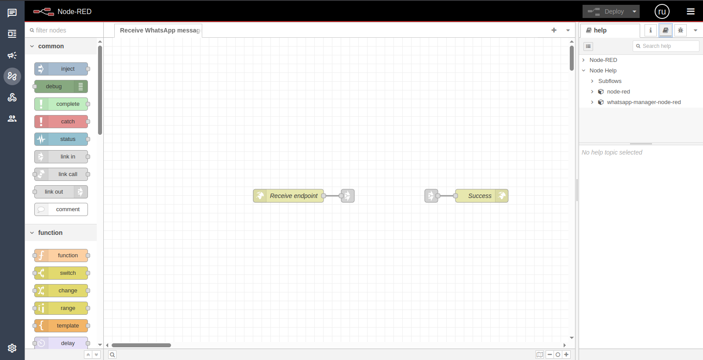
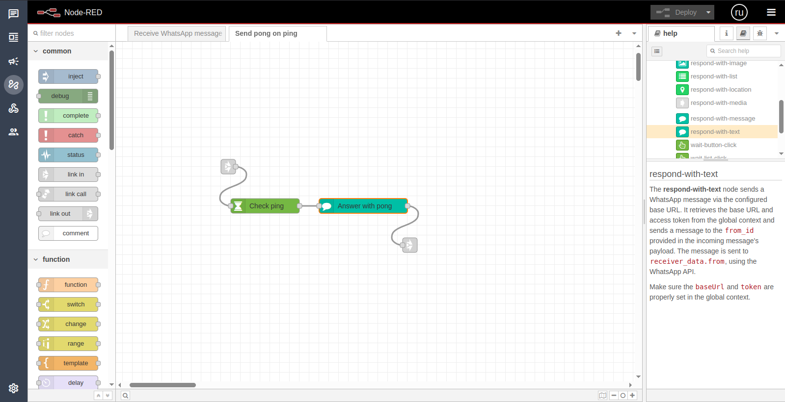

# 🤖 Node‑RED Integration

> **Supporter‑only feature** – unlock via the [support plans](../support/plans.md) to
> receive the `wacraft‑nodered` image and source code.

Automate WhatsApp conversations with **visual flows**: trigger on inbound
messages, call external APIs, and send interactive replies – all without
writing Go or JavaScript.

## 1 — How it works

```
┌────────────┐    Webhook  ┌──────────────┐  REST/WS   ┌─────────────┐
│  WhatsApp  │────────────>│wacraft‑server│───────────>│  Node‑RED   │
│  Cloud API │             │     (Go)     │            │  Flows      │
└────────────┘             └──────────────┘<───────────┤             │
        ▲                       ▲   ▲   ▲    HTTP      │   Any DB/   │
        │                       │   │   └──────────────┤   Service   │
        │                       │   └───────── Trigger │             │
        │                       └────────── Send Msg   └─────────────┘
```

The Node‑RED container authenticates with your **running wacraft‑server** using
`SU_PASSWORD` over HTTPS. Custom nodes (`wait‑text‑message‑match`,
`respond‑with‑text`, etc.) wrap the wacraft REST endpoints, turning low‑level
JSON calls into drag‑and‑drop blocks.

## 2 — Deploy

### 2.1 Standalone Docker

```bash
docker run -d --name wacraft-nodered \
  -e SU_PASSWORD=<SU_PASSWORD> \
  -e SERVER_HOST=https://api.example.com \
  -p 1880:1880 \
  --restart unless-stopped \
  astervia/wacraft-nodered:v0.1.0
```

| Env var       | Description                                          |
| ------------- | ---------------------------------------------------- |
| `SU_PASSWORD` | Same super‑user pass you set in your wacraft server. |
| `SERVER_HOST` | Public URL of the server (**protocol included**).    |

### 2.2 Compose stack

1. Edit `docker-compose.yml` (supporters repo) and uncomment the
   `nodered` service block.
2. Add the two env vars above to your main `.env`.
3. Recreate:

```bash
docker compose up -d --build nodered
```

Node‑RED UI → `https://nodered.example.com` (or `:1880` if local).

## 3 — First flow: **receive message**

1. Log in to the **wacraft UI** → **Automations**.
2. Click **➕** → **Import** and paste the JSON below.
3. Deploy.

```json
[
    {
        "id": "0ff445d6d247a50e",
        "type": "tab",
        "label": "Receive WhatsApp message",
        "disabled": false,
        "info": ""
    },
    {
        "id": "77466c5e3382df81",
        "type": "http in",
        "z": "0ff445d6d247a50e",
        "name": "Receive endpoint",
        "url": "/webhook-in/whatsapp/message/receive",
        "method": "post",
        "upload": false,
        "swaggerDoc": ""
    },
    {
        "id": "046026af5a9c6dd4",
        "type": "http response",
        "z": "0ff445d6d247a50e",
        "name": "Success",
        "statusCode": "200"
    },
    {
        "id": "c122c47566ca712b",
        "type": "link out",
        "z": "0ff445d6d247a50e",
        "name": "receive",
        "mode": "link",
        "links": ["aac9a9ba20bedf67"]
    },
    {
        "id": "95014bee9298fe9d",
        "type": "link in",
        "z": "0ff445d6d247a50e",
        "name": "response",
        "links": ["45be4f514ab7f204"]
    }
]
```



Register the webhook in **wacraft → Webhooks** pointing to:
`https://nodered.example.com/webhook-in/whatsapp/message/receive`.

## 4 — Ping → Pong example

Import the second flow to auto‑reply "pong" whenever a user sends "ping".

```json
[
    {
        "id": "4cf16c53f88e1ecc",
        "type": "tab",
        "label": "Send pong on ping"
    },
    {
        "id": "aac9a9ba20bedf67",
        "type": "link in",
        "z": "4cf16c53f88e1ecc",
        "links": ["c122c47566ca712b"]
    },
    {
        "id": "78c14e9ddab5c294",
        "type": "wait-text-message-match",
        "z": "4cf16c53f88e1ecc",
        "name": "Check ping",
        "desiredText": "ping"
    },
    {
        "id": "7f1b6653728520e7",
        "type": "respond-with-text",
        "z": "4cf16c53f88e1ecc",
        "name": "Answer with pong",
        "text": "pong"
    },
    {
        "id": "45be4f514ab7f204",
        "type": "link out",
        "z": "4cf16c53f88e1ecc",
        "links": ["95014bee9298fe9d"]
    }
]
```



Send **ping** from WhatsApp; receive **pong** back – congrats! 🎉

## 5 — Available nodes (cheat‑sheet)

Full reference lives inside Node‑RED → **Wacraft Nodes** panel.

## 6 — Support & customisation

- **Contact:** [wacraft@astervia.tech](mailto:wacraft@astervia.tech)
- **Repo (only for supporters):** [https://github.com/Astervia/wacraft-node-red-defaults](https://github.com/Astervia/wacraft-node-red-defaults)
- We can tailor nodes, build high‑scale deployments, or review your flows.

Enjoy building no‑code automations! ✨
