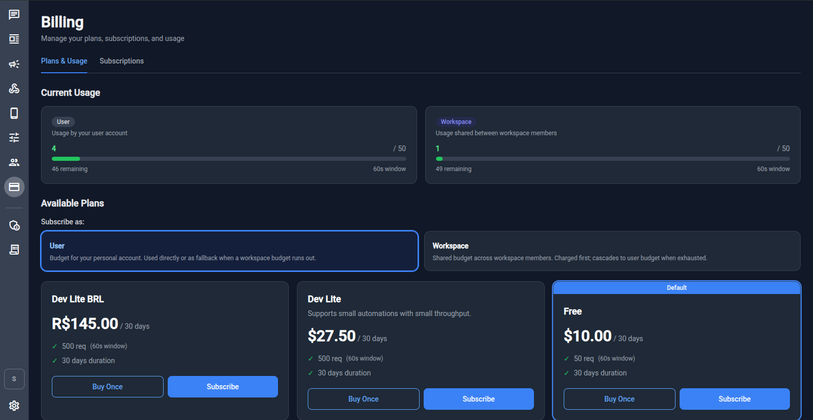
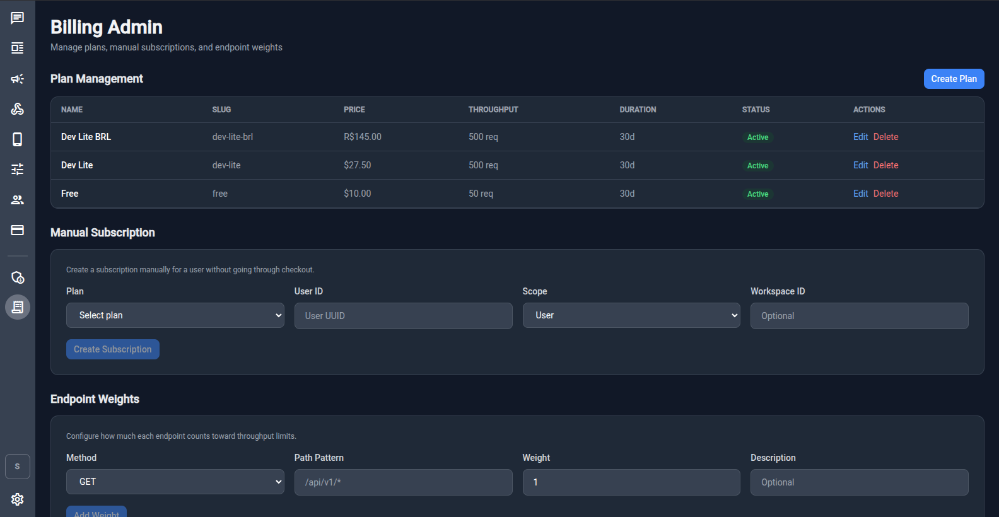

# 💳 Billing

wacraft includes a built‑in billing system powered by **Stripe**. It allows platform operators to offer throughput‑based subscription plans. Billing is **optional** — see [Stripe Setup](../config/stripe-setup.md) to enable it.

## User Billing (`/billing`)

Regular users access billing at `/billing`. The page has two tabs:

- **Plans & Usage** – view current usage and subscribe to plans
- **Subscriptions** – manage active subscriptions

### Current Usage

The **Current Usage** section shows two gauges:

| Gauge         | What it tracks                                                                     |
| ------------- | ---------------------------------------------------------------------------------- |
| **User**      | Requests made by your personal account. Used directly or as fallback when a workspace budget runs out. |
| **Workspace** | Requests shared between all workspace members. Charged first; cascades to user budget when exhausted. |

Each gauge shows the current count, the limit, the remaining requests, and the rate window (e.g. 60 seconds).

### Available Plans

Plans are displayed as cards showing:

- Name and price
- Throughput limit (requests per window)
- Duration

Each plan has two purchase options:

| Option        | Description                                                 |
| ------------- | ----------------------------------------------------------- |
| **Buy Once**  | A one‑time payment. The plan is active until `expires_at`. |
| **Subscribe** | A recurring subscription. Renews automatically.             |

### Subscribe as User or Workspace

Use the **Subscribe as** toggle to choose the subscription scope:

- **User** – budget applies to your personal account.
- **Workspace** – budget is shared across all workspace members and is charged first.

## Billing Admin

Admin users (global role `admin`) access the billing admin panel at `/billing-admin`.

### Plan Management

View, create, edit, and delete plans. Each plan has:

| Field           | Description                                             |
| --------------- | ------------------------------------------------------- |
| **Name**        | Display name (e.g. "Dev Lite", "Pro")                  |
| **Slug**        | URL‑friendly identifier (e.g. `dev-lite`)              |
| **Price**       | Price with currency                                     |
| **Throughput**  | Request limit per window (e.g. 500 req)                |
| **Duration**    | How long the plan lasts (e.g. 30 days)                 |
| **Status**      | Active or inactive                                      |

Click **Create Plan** to add a new plan. Plans can be in multiple currencies.

### Manual Subscription

Create a subscription for a user **without going through Stripe Checkout**. Useful for comping a plan or testing.

| Field           | Description                                       |
| --------------- | ------------------------------------------------- |
| **Plan**        | Select which plan to assign                       |
| **User ID**     | UUID of the target user                           |
| **Scope**       | `User` or `Workspace`                             |
| **Workspace ID** | Required when scope is `Workspace`               |

Click **Create Subscription** to activate immediately.

### Endpoint Weights

Configure how much each API endpoint contributes to throughput limits. This lets you charge more for expensive operations (e.g. sending messages) and less for cheap reads.

| Field            | Description                                             |
| ---------------- | ------------------------------------------------------- |
| **Method**       | HTTP method (GET, POST, PATCH, DELETE, …)              |
| **Path Pattern** | Path pattern to match (e.g. `/api/v1/*`)               |
| **Weight**       | How many throughput units this request counts as        |
| **Description**  | Optional label                                          |

Click **Add Weight** to save a new endpoint weight rule.

## How Throughput Works

1. Every API request is checked against the active subscription for the user and workspace.
2. Workspace budget is consumed first. When exhausted, requests fall back to the user's personal budget.
3. Requests exceeding all budgets are rate‑limited (`429 Too Many Requests`).
4. Usage resets at the end of each **window** (e.g. every 60 seconds).

## Next Steps

- [Stripe Setup](../config/stripe-setup.md) — configure Stripe keys and webhook
- [Workspaces & Permissions](./workspaces.md) — assign `billing.manage` policy to workspace members
