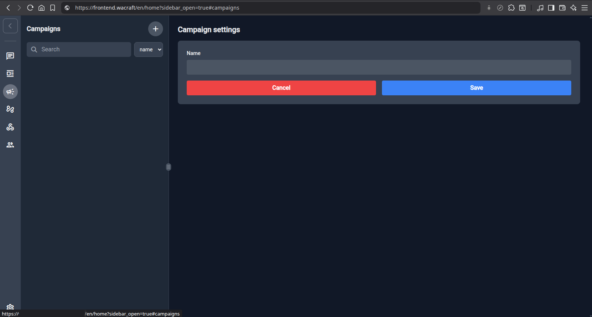
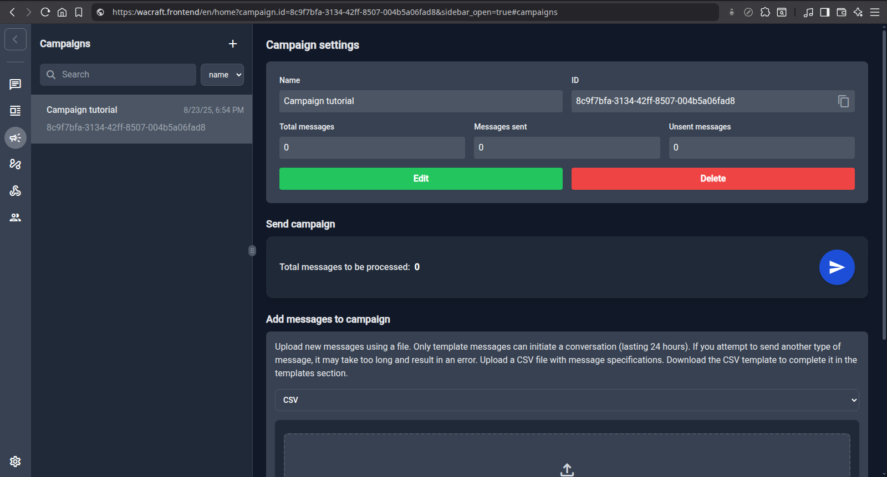
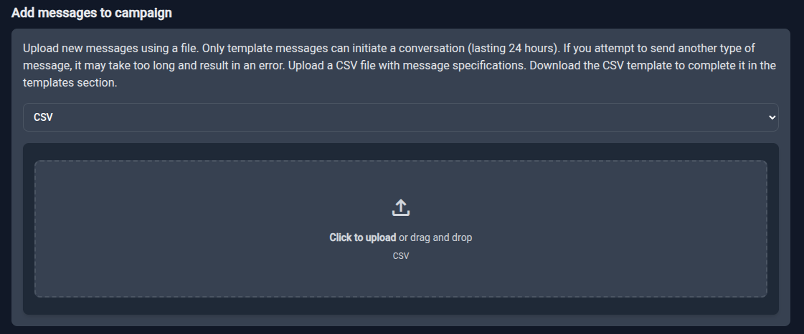
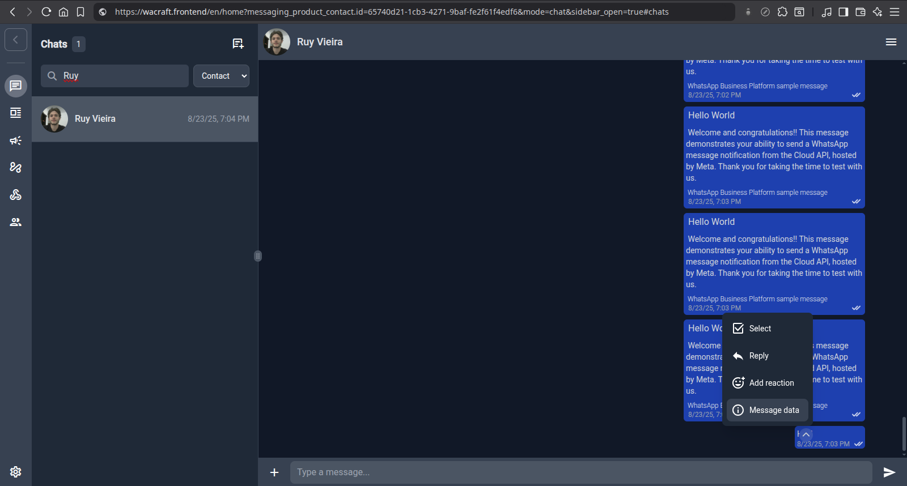
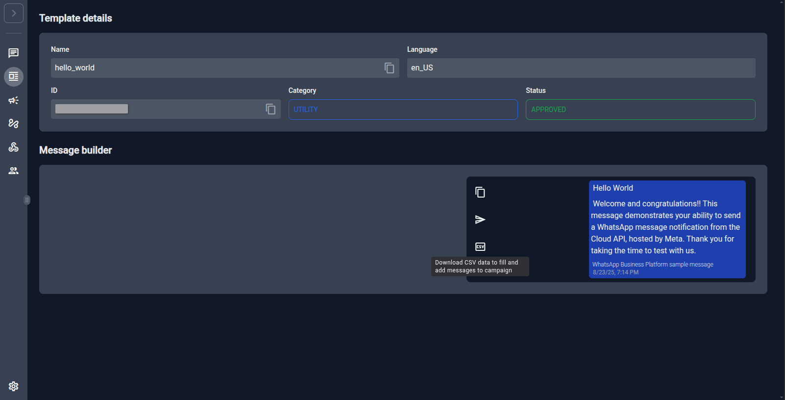
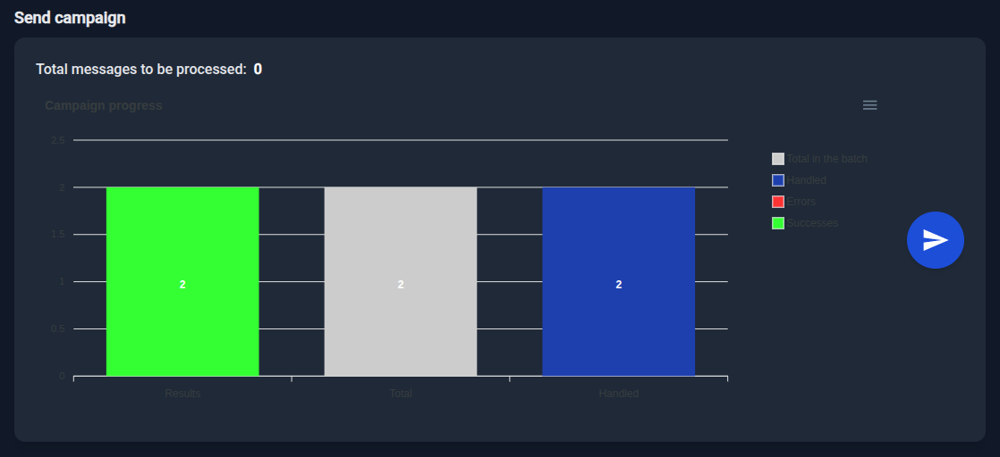

# Campaigns

> **Supporter‑only feature** – unlock via the [support plans](../support/plans.md) to
> receive the source code with this feature.

Campaigns allow you to send bulk messages to users. You can send any kind of message, but be aware of the 24 hour conversation limit when sending non template messages.

To create a campaign you need to have an active deployment. We'll suppose that your frontend is deployed at [https://wacraft.frontend](https://wacraft.frontend)

First, go to [https://wacraft.frontend/en/home?sidebar_open=true#campaigns](https://wacraft.frontend/en/home?sidebar_open=true#campaigns) and click the plust icon to create a new campaign.



Choose a beautiful name, click save and you created your first campaign! You should be in your campaign page. And see all campaigns at the left navbar.



Now you need to add messages to your campaign. There are two ways of adding messages:

1. You can download a template csv and fill it out;
2. You can add raw json data.

We recomend you to use the campaign feature to bulk send templates, so the option 1 is our sugestion.



To add raw json data, simply select JSON and add an array of raw data to send whatsapp messages. An example is:

```json
[
    {
        "recipient_type": "individual",
        "messaging_product": "whatsapp",
        "to": "999999999999",
        "type": "template",
        "template": {
            "name": "hello_world",
            "language": {
                "code": "en_US"
            },
            "components": []
        }
    },
    {
        "recipient_type": "individual",
        "messaging_product": "whatsapp",
        "to": "999999999999",
        "type": "text",
        "text": {
            "preview_url": true,
            "body": "Hey!"
        }
    }
]
```

The expected json is an array of elements that represent an whatsapp message. You can check the proper format at [Meta reference](https://developers.facebook.com/docs/whatsapp/cloud-api/guides/send-messages).
One option to easily get the message object is send the message using the chats page, then you click on message options -> Message data



And you will see the message raw data. Copy it and extract the `sender_data` part. This is the json that you can use on campaigns to send this message. You only have to change the `to` field to the proper contact.

To add messages via csv you first have to copy the csv template for the WhatsApp template you want to send. Here's an example with `hello_world` template:

1. Go to the [templates page](https://wacraft.frontend/en/home?sidebar_open=true#templates)
2. Select the template you want: we'll use [`hello_world`](https://wacraft.frontend/en/home?sidebar_open=false&template.name=hello_world#templates)
3. Copy the template csv
   
4. Fill the csv
   CSV content example

    ```csv
    messaging_product,recipient_type,to,type,template.name,template.language.code,template.components
    whatsapp,individual,9999999999,template,hello_world,en_US,[]
    whatsapp,individual,9999999999,template,hello_world,en_US,[]
    ```

5. Upload the file at the campaing and click to add messages

Once you add your messages you'll be able to send them inside the campaign. At the bottom of the campaign page you can see all the messages that you just added.
After clicking the button to send you must wait for all messages to be processed and see a graphic like this:



[describe the graphic here]

And you sent your first campaign. You can see errors if any within the messages at the bottom of the page.

Disclaimer: although some messages not fail, WhatsApp can refuse to send some messages after some time because of your account limitations or other restrictions. Hence you should check the status of the messages after some time in the chats page.

# 🚀 Campaigns Guide

> **Supporter‑only feature** – This feature is unlocked for our supporters. Please see the [support plans](https://www.google.com/search?q=../support/plans.md) to learn more.

Campaigns are a powerful tool for sending bulk messages to your contacts. You can send any type of message, but it's important to be aware of WhatsApp's 24-hour conversation window. You can only **initiate** a conversation with a template message. Non-template messages can only be sent to users who have contacted you in the last 24 hours.

This guide will walk you through creating and sending your first campaign.

### Step 1: Create the Campaign

First, navigate to the **Campaigns** section from the main sidebar.

1.  Click the **+** icon at the top of the campaigns list to begin.

2.  Give your campaign a descriptive name, like "New Feature Announcement," and click **Save**.

You have now created your campaign\! You will land on its main dashboard.

### Step 2: Add Messages to Your Campaign

There are two ways to add messages to a campaign: uploading a pre-filled **CSV file (recommended)** or providing raw **JSON data (advanced)**.

#### Method 1: Using a CSV File (Recommended)

This is the easiest way to send a bulk campaign based on an approved WhatsApp template.

1.  Navigate to the **Templates** page and select the template you wish to use, such as `hello_world`.

2.  In the template details view, click the **CSV icon** to download a CSV file formatted specifically for this template.

3.  Open the downloaded file and populate the `to` column with your contacts' phone numbers. If your template has variables, there will be additional columns to fill.

    **Example CSV Content:**

    ```csv
    messaging_product,recipient_type,to,type,template.name,template.language.code,template.components
    whatsapp,individual,5511999999999,template,hello_world,en_US,[]
    whatsapp,individual,5521888888888,template,hello_world,en_US,[]
    ```

4.  Save the CSV and return to your campaign dashboard. In the **Add messages to campaign** section, drag and drop or upload your completed file.

#### Method 2: Using Raw JSON (Advanced)

This method offers more flexibility and allows for sending non-template messages (within the 24-hour window).

1.  In the **Add messages to campaign** section, select **JSON** from the dropdown.

2.  Paste an array of message objects into the text field. You can find the required format in the [Meta API Reference](https://developers.facebook.com/docs/whatsapp/cloud-api/guides/send-messages).

    **Example JSON Array:**

    ```json
    [
        {
            "recipient_type": "individual",
            "messaging_product": "whatsapp",
            "to": "5511999999999",
            "type": "template",
            "template": {
                "name": "hello_world",
                "language": {
                    "code": "en_US"
                },
                "components": []
            }
        },
        {
            "recipient_type": "individual",
            "messaging_product": "whatsapp",
            "to": "5521888888888",
            "type": "text",
            "text": {
                "preview_url": true,
                "body": "Hey!"
            }
        }
    ]
    ```

    **Tip:** A quick way to get the correct JSON for a specific message is to send it once from the **Chats** page, then click on the message options and select **Message data**. You can then copy the `sender_data` object and modify the `to` field.

### Step 3: Send and Monitor Your Campaign

After uploading your messages (via CSV or JSON), they will appear in a list at the bottom of the campaign page.

1.  Review the messages to ensure they are correct.

2.  When you're ready, click the blue **Send (▶️)** button.

3.  Wait for the messages to be processed. A progress graph will appear, giving you a real-time overview.

The progress graph displays:

- **Total**: The total number of messages in the batch.
- **Handled**: How many messages the server has attempted to send.
- **Successes**: Messages that were successfully sent to the WhatsApp API.
- **Errors**: Messages that failed to send. You can see specific error details in the message list below the graph.

Congratulations, you've sent your first campaign\!

> **Disclaimer:** A "success" in the progress chart indicates that the message was accepted by Meta's API. However, final delivery can still be affected by WhatsApp's policies or your account status. For definitive delivery confirmation, always check the message status in the **Chats** page after some time.
