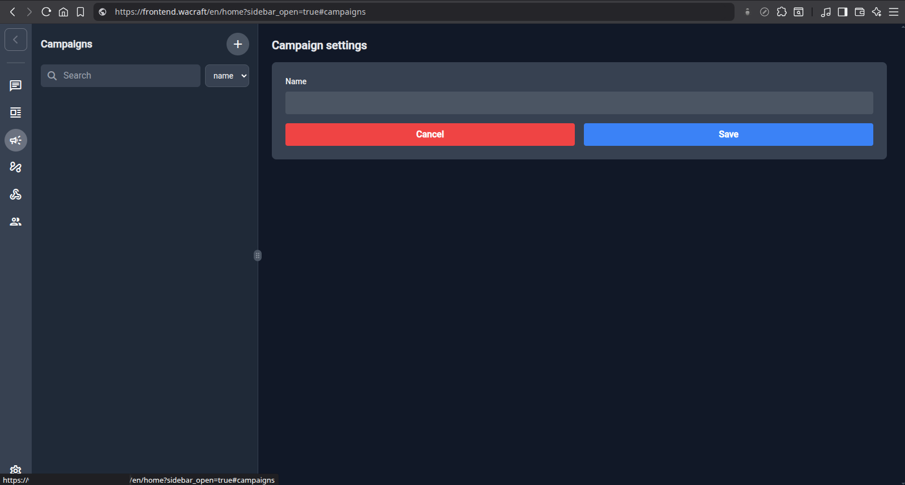
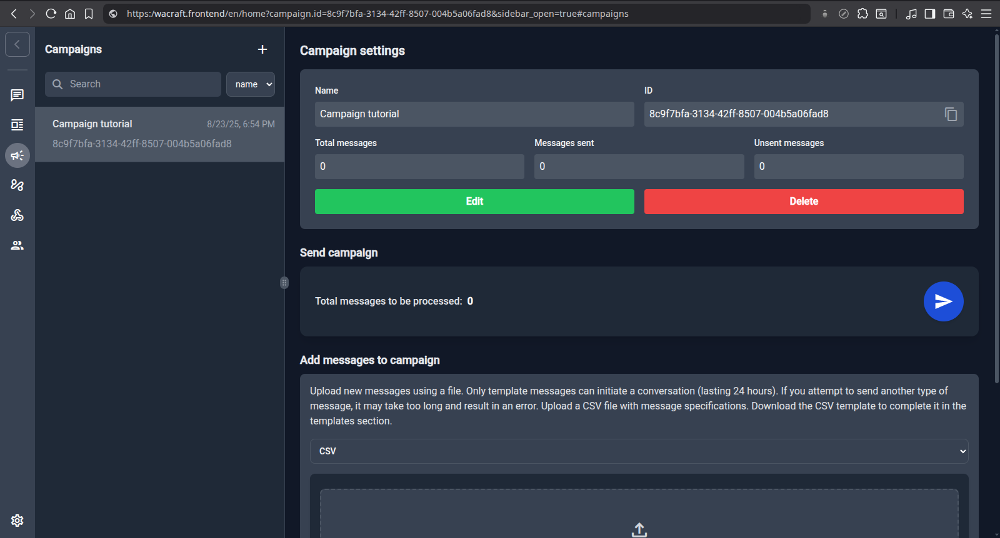
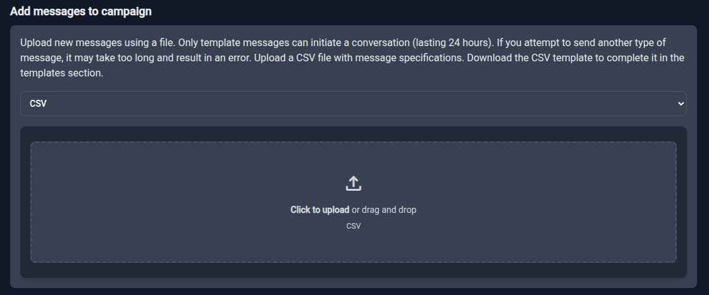
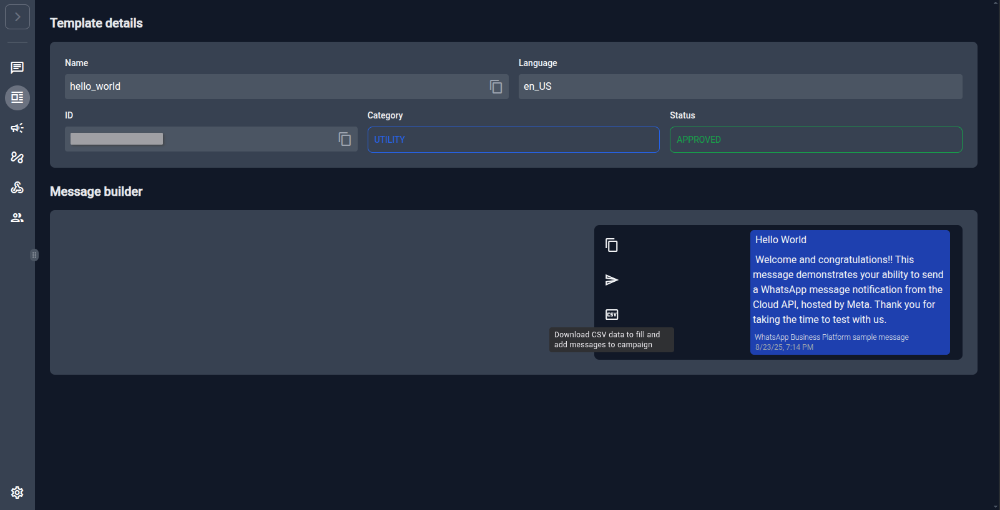
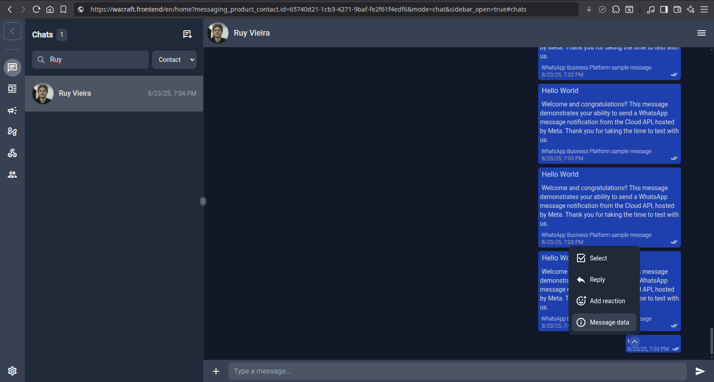
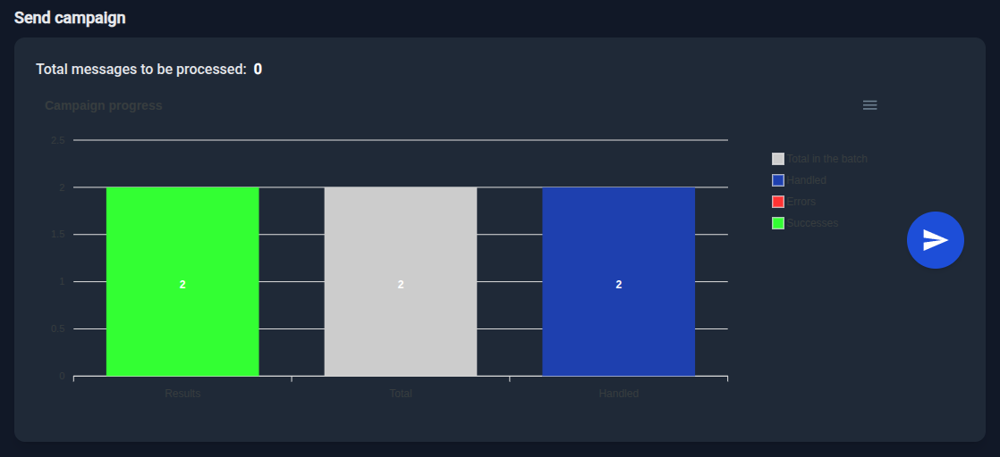

# Campaigns

Campaigns allow you to send bulk messages to contacts. You can send any kind of message, but be aware of WhatsApp's 24‑hour conversation window: only **template messages** can initiate a new conversation.

## Step 1: Create the Campaign

Navigate to **Campaigns** from the sidebar and click the **+** icon to create a new campaign.



Give it a descriptive name and click **Save**.



## Step 2: Add Messages



There are two ways to add messages:

### Method 1: CSV (Recommended)

1. Go to the **Templates** page and select the template you want to use.
2. Click the **CSV icon** to download a pre‑formatted CSV file.

    

3. Fill in the `to` column with phone numbers. If the template has variables, fill those columns too.

    ```csv
    messaging_product,recipient_type,to,type,template.name,template.language.code,template.components
    whatsapp,individual,5511999999999,template,hello_world,en_US,[]
    whatsapp,individual,5521888888888,template,hello_world,en_US,[]
    ```

4. Return to the campaign page and upload the CSV in the **Add messages to campaign** section.

### Method 2: Raw JSON

Select **JSON** and paste an array of WhatsApp message objects:

```json
[
    {
        "recipient_type": "individual",
        "messaging_product": "whatsapp",
        "to": "5511999999999",
        "type": "template",
        "template": {
            "name": "hello_world",
            "language": { "code": "en_US" },
            "components": []
        }
    }
]
```

See the [Meta API Reference](https://developers.facebook.com/docs/whatsapp/cloud-api/guides/send-messages) for the full message format.

**Tip:** Send a message from the Chats page, click **message options → Message data** and copy the `sender_data` object.



## Step 3: Send and Monitor

Click the blue **Send ▶️** button. A progress graph appears in real time showing:

- **Total** – messages in the batch
- **Handled** – messages the server has processed
- **Successes** – messages accepted by Meta's API
- **Errors** – messages that failed (details visible in the list below)



> **Note:** "Success" means Meta's API accepted the message. For final delivery status, check the **Chats** page after some time. WhatsApp can still apply delivery restrictions based on your account status.

## Required Policies

To create and run campaigns you need the following [workspace policies](./workspaces.md):

| Action              | Required Policy    |
| ------------------- | ------------------ |
| View campaigns      | `campaign.read`    |
| Create/edit         | `campaign.manage`  |
| Send (run)          | `campaign.run`     |
