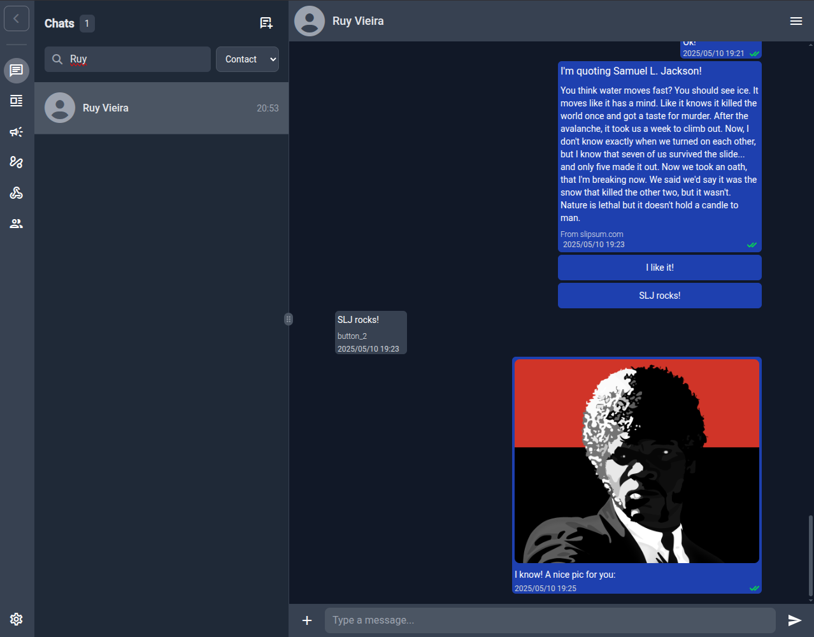
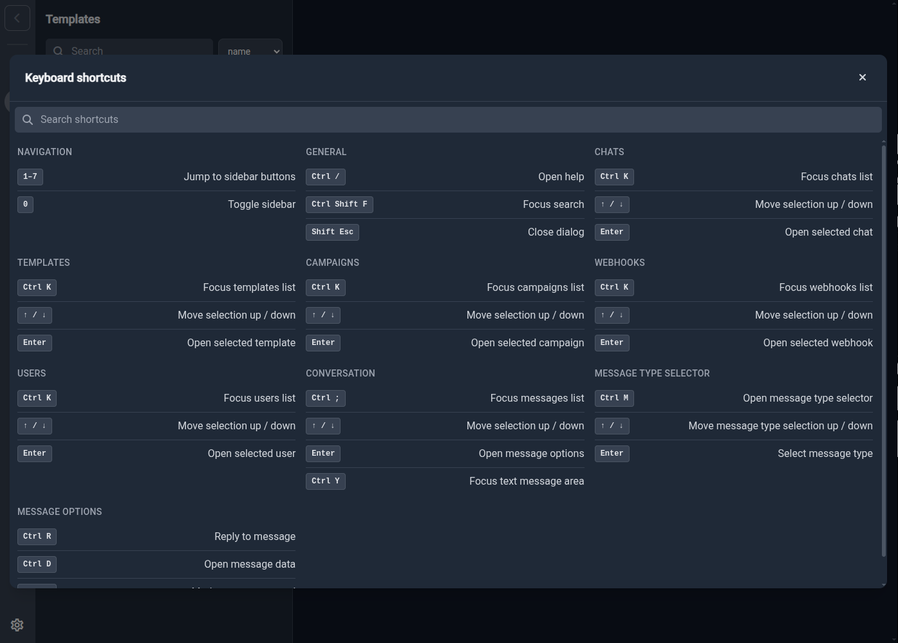
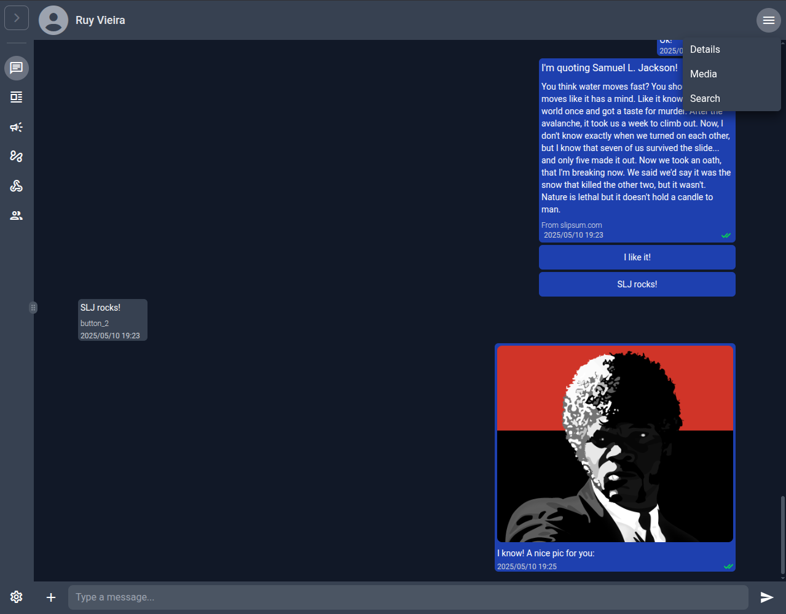
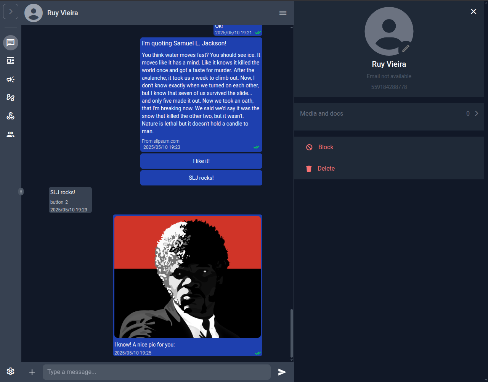
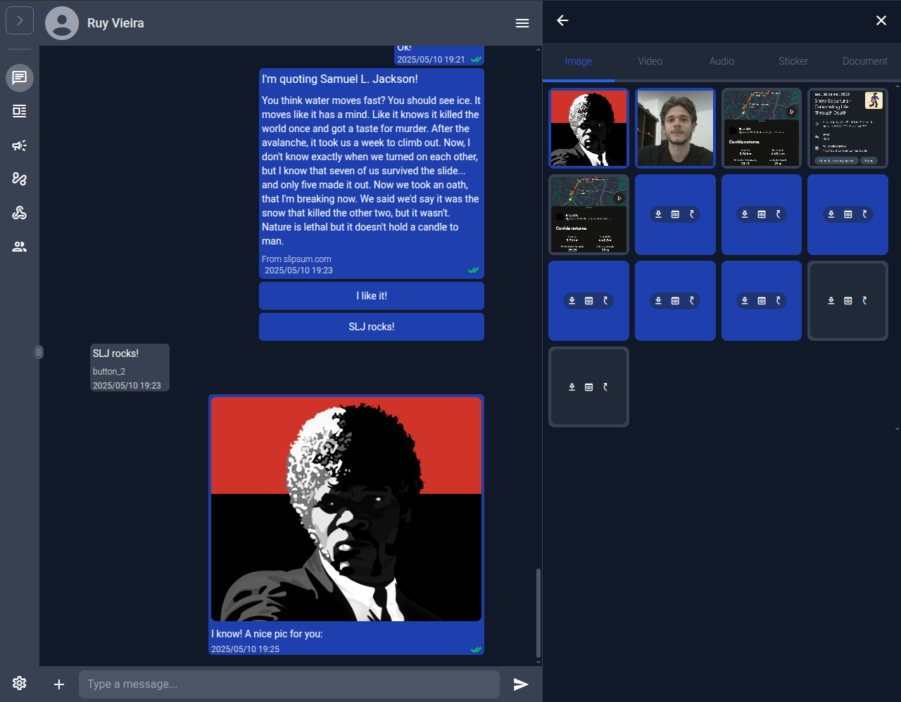
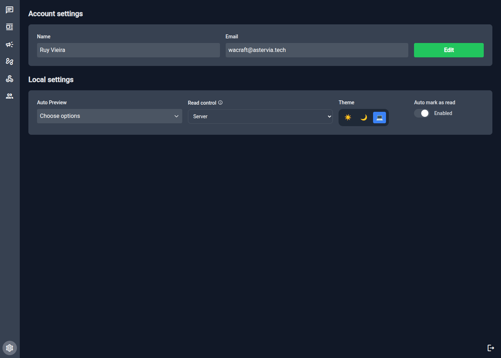
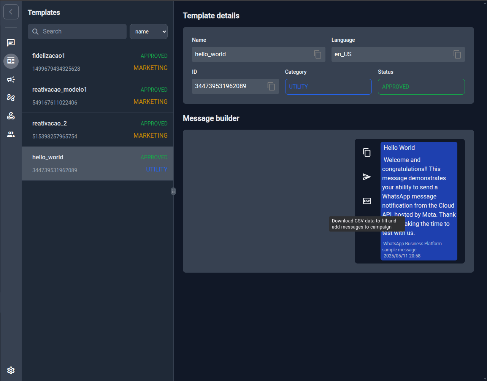
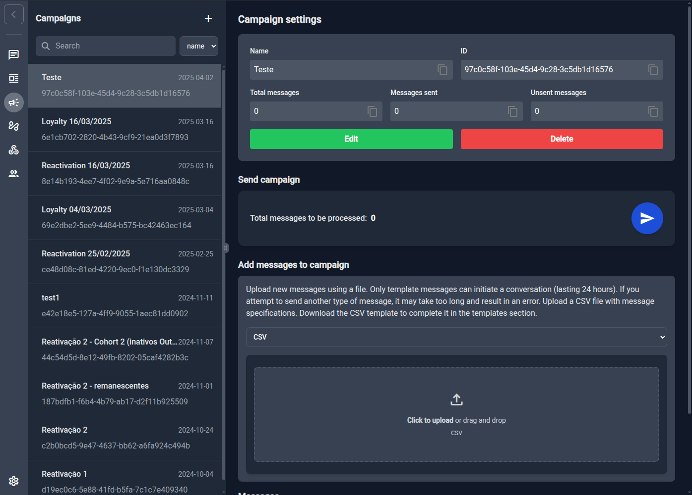
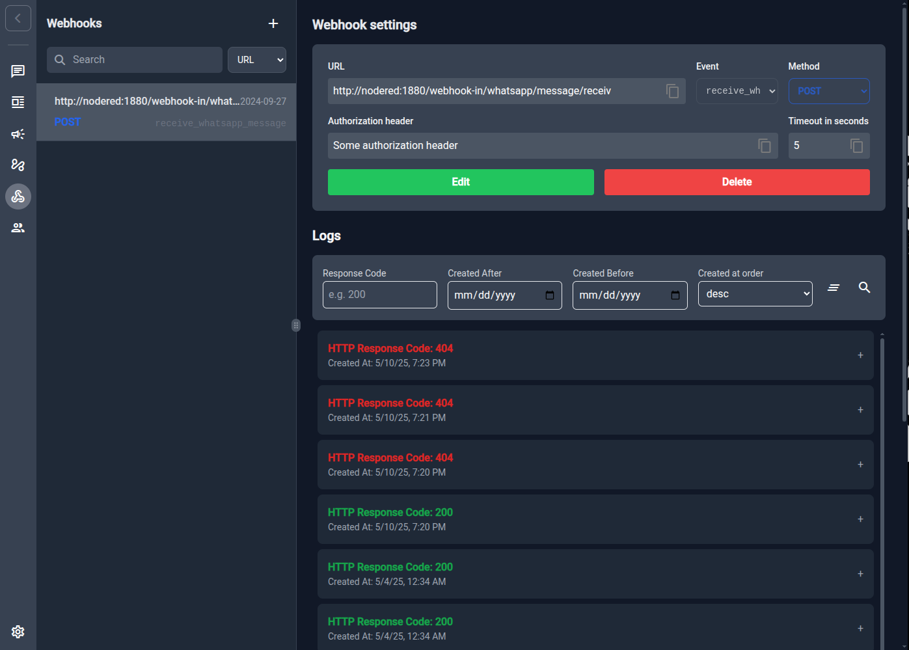

# 🖥️ wacraft UI Walkthrough

Welcome to a quick tour of the **wacraft‑client** interface. This guide covers
the daily workflow for operators and admins, from chatting with users to
sending bulk campaigns and wiring automations.

## 1 — Layout at a glance



| Area                      | What you’ll find                                                                                             |
| ------------------------- | ------------------------------------------------------------------------------------------------------------ |
| **(A) Sidebar**           | Vertical icons for Chats, Templates, Campaigns, Webhooks, Users, Settings. Hit **1–7** to jump via keyboard. |
| **(B) List panel**        | Context‑aware list (chats, templates, etc.). Supports search and column sort.                                |
| **(C) Workspace**         | Main content: conversations, builders, settings.                                                             |
| **(D) Utility bar**       | Per‑page actions (menu, filter, CSV export, etc.).                                                           |
| **(E) Composer / Footer** | Message input or save / edit buttons.                                                                        |

> **Keyboard power‑users:** press **Ctrl /** anywhere to open the shortcut cheat‑sheet.



## 2 — Chats & Conversation tools

### 2.1 Live chat



- Hover and click the corner or press **Enter** to open **message options**: reply,
  mark as read, view metadata or add reaction.
- Click the hamburger menu (**⋮**) for **conversation options**: contact
  details, shared media and message search.

### 2.2 Contact details & Media gallery

| Details panel                                                              | Media & docs                                                           |
| -------------------------------------------------------------------------- | ---------------------------------------------------------------------- |
|  |  |

Both panes slide in from the right without leaving the chat context.

## 3 — Account & Local settings



- **Read control:** decide whether read receipts are manual or synced from the
  server.
- **Theme switcher:** Light, Dark, or System (auto).
- **Auto preview & mark as read:** tweak message behaviour only for _your_
  browser; doesn’t affect other agents.

## 4 — Templates ➡️ CSV ➡️ Campaigns

The fastest way to launch a bulk send is **Template → CSV → Campaign**.

1. **Open Templates** in the sidebar _(hotkey **4**)_.
   Hover a template and click the **📄 CSV** button.

    

2. A CSV is downloaded with the exact variables required by that template.
   _Fill it_: one row per recipient.

```csv
messaging_product,recipient_type,to,type,template.name,template.language.code,template.components
whatsapp,individual,1111111111,template,hello_world,en_US,[]
whatsapp,individual,2222222222,template,hello_world,en_US,[]
whatsapp,individual,3333333333,template,hello_world,en_US,[]
```

3. Go to **Campaigns** _(hotkey **5**)_ and **➕ New Campaign**.
   Give it a name.

4. In **Add messages to campaign** drag‑and‑drop the CSV or click to upload.

    

5. Review totals, then hit the blue **Send ▶️** button. Status updates live
   (messages sent / unsent). That’s it – campaign en‑route!

> **Tip:** You can download _any_ template’s CSV, copy rows across files and
> reuse them later; IDs are preserved.

## 5 — Webhooks & Logs



- Register outbound events (e.g. **receive_whatsapp_message**) with URL,
  timeout and optional auth header.
- Built‑in log viewer with code/filter/search to track success and failures.

## 6 — Power navigation cheatsheet

| Task                      | Shortcut       |
| ------------------------- | -------------- |
| Jump to sidebar item 1‑7  | `1` … `7`      |
| Global search             | `Ctrl Shift F` |
| Focus text input in chat  | `Ctrl Y`       |
| Open **Help / Shortcuts** | `Ctrl /`       |
| Reply to message          | `Ctrl R`       |
| Open message data         | `Ctrl D`       |

> **Shift Esc** closes any modal/dialog instantly.

## 7 — What’s next?

- Wire **Node‑RED** automations → see [Node‑RED Integration](../deploy/node-red.md).
- Build CSV campaigns at scale with the **Campaigns API**.
- Explore advanced search and keyboard workflows – you can operate the whole
  client without a mouse!

Happy messaging 🚀
