# 🖥️ wacraft UI Walkthrough

Welcome to a quick tour of the **wacraft‑client** interface. This guide covers
the daily workflow for operators and admins, from chatting with contacts to
managing workspace members and billing.

## 1 — Layout at a glance

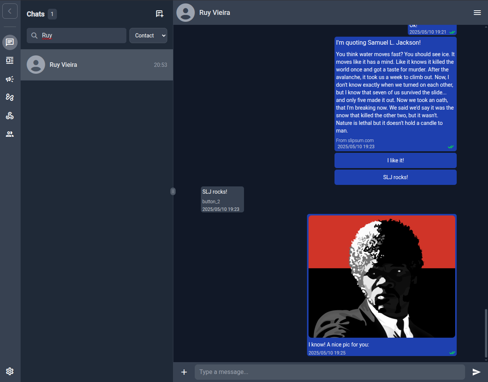

| Area                      | What you'll find                                                                                              |
| ------------------------- | ------------------------------------------------------------------------------------------------------------- |
| **(A) Sidebar**           | Vertical icons for Chats, Templates, Campaigns, Webhooks, Phone Configs, Workspace Members, and more.        |
| **(B) List panel**        | Context‑aware list (chats, templates, etc.). Supports search and column sort.                                 |
| **(C) Workspace**         | Main content: conversations, builders, settings.                                                              |
| **(D) Utility bar**       | Per‑page actions (menu, filter, CSV export, etc.).                                                            |
| **(E) Composer / Footer** | Message input or save / edit buttons.                                                                         |

> **Keyboard power‑users:** press **Ctrl /** anywhere to open the shortcut cheat‑sheet.

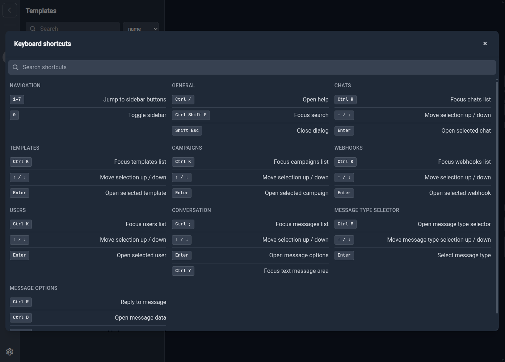

## 2 — Chats & Conversation tools

### 2.1 Live chat

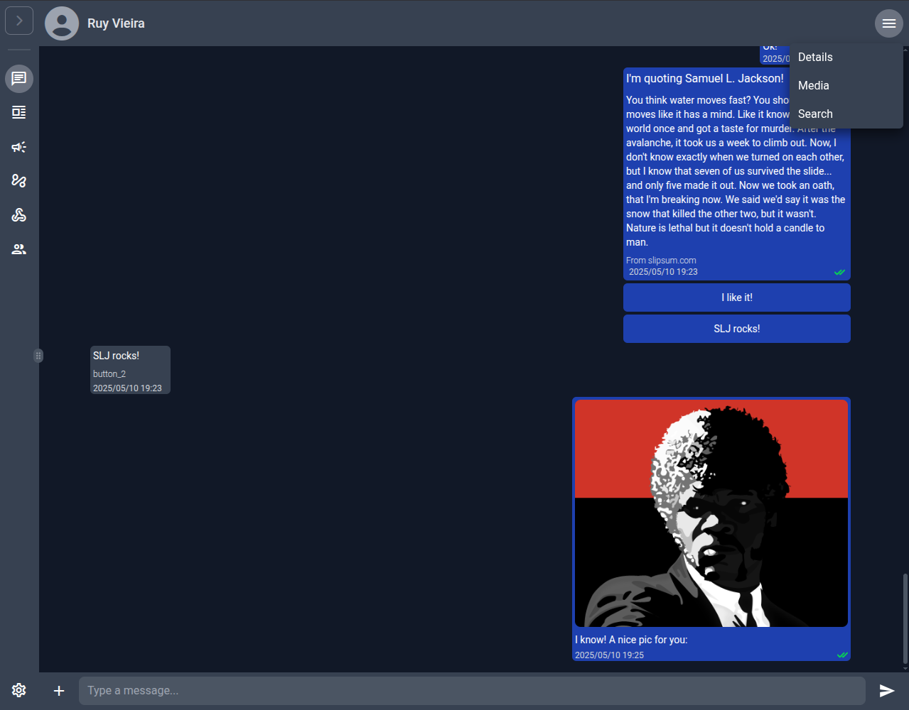

- Hover and click the corner or press **Enter** to open **message options**: reply,
  mark as read, view metadata or add reaction.
- Click the hamburger menu (**⋮**) for **conversation options**: contact
  details, shared media and message search.

### 2.2 Contact details & Media gallery

| Details panel                                                              | Media & docs                                                           |
| -------------------------------------------------------------------------- | ---------------------------------------------------------------------- |
| 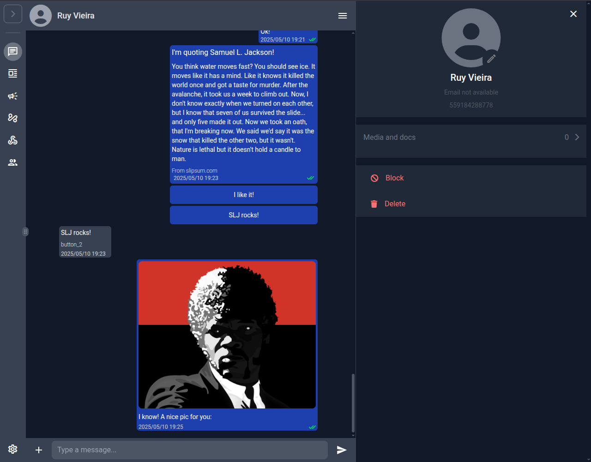 | 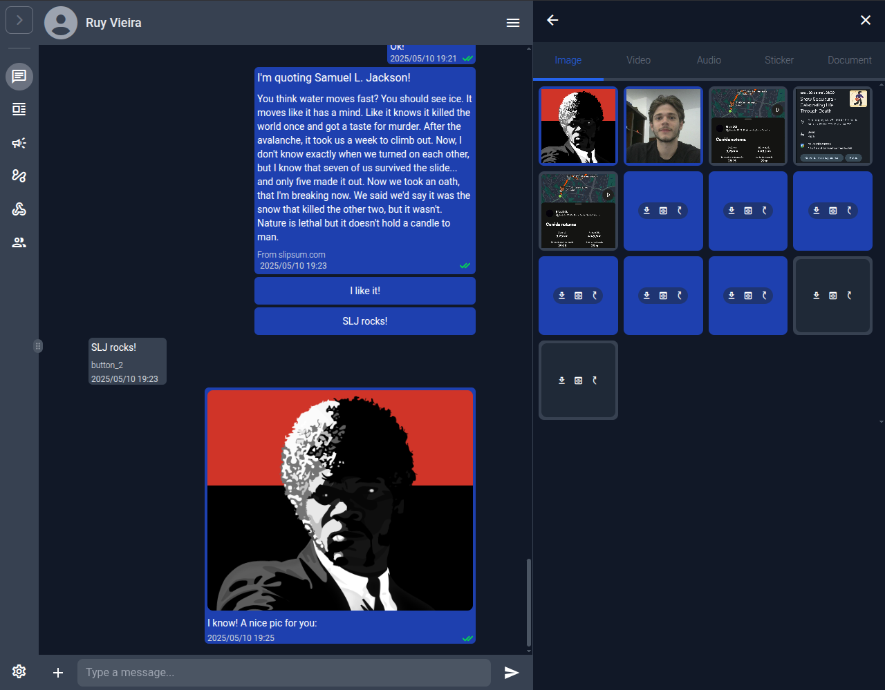 |

Both panes slide in from the right without leaving the chat context.

## 3 — Account & Local settings

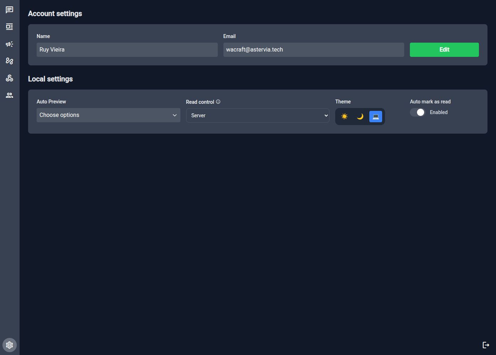

- **Read control:** decide whether read receipts are manual or synced from the server.
- **Theme switcher:** Light, Dark, or System (auto).
- **Auto preview & mark as read:** tweak message behaviour only for _your_ browser.

## 4 — Phone Configs (`/phone-configs`)

Manage the WhatsApp phone numbers connected to this workspace. Click **New Phone Config** to add a number.

See [Phone Config Guide](../config/phone-config.md) for field descriptions and a full walkthrough.

## 5 — Workspace Members (`/workspace-members`)

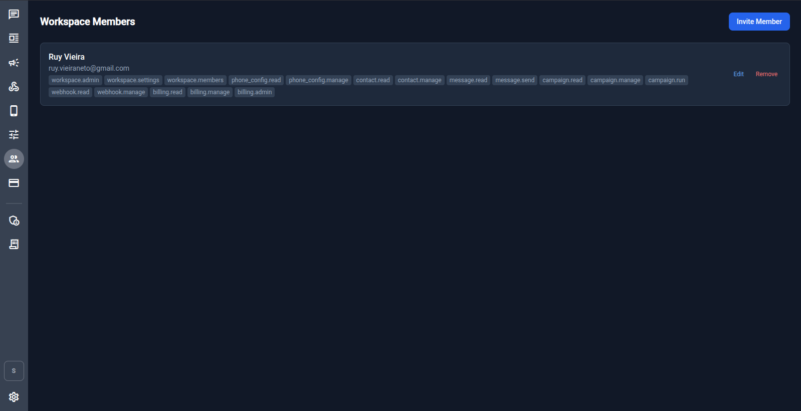

Invite team members and assign them granular **policies** (e.g. `message.send`, `campaign.run`). Click **Invite Member** to send an invitation.

See [Workspaces & Permissions](./workspaces.md) for the full policy reference.

## 6 — Workspace Settings (`/workspace-settings`)

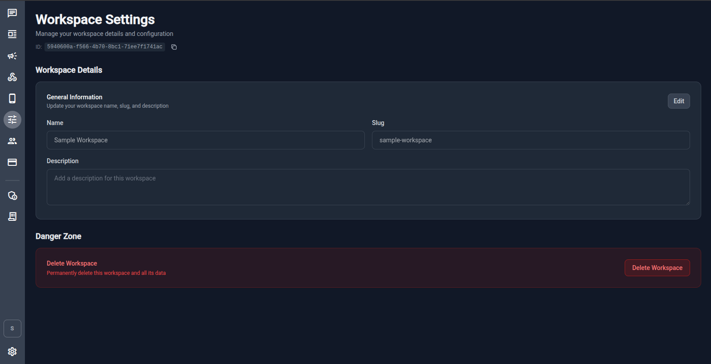

Edit the workspace name, slug, and description. The **Danger Zone** lets you permanently delete the workspace.

## 7 — Templates ➡️ CSV ➡️ Campaigns

The fastest way to launch a bulk send is **Template → CSV → Campaign**.

1. **Open Templates** in the sidebar.
   Hover a template and click the **📄 CSV** button.

    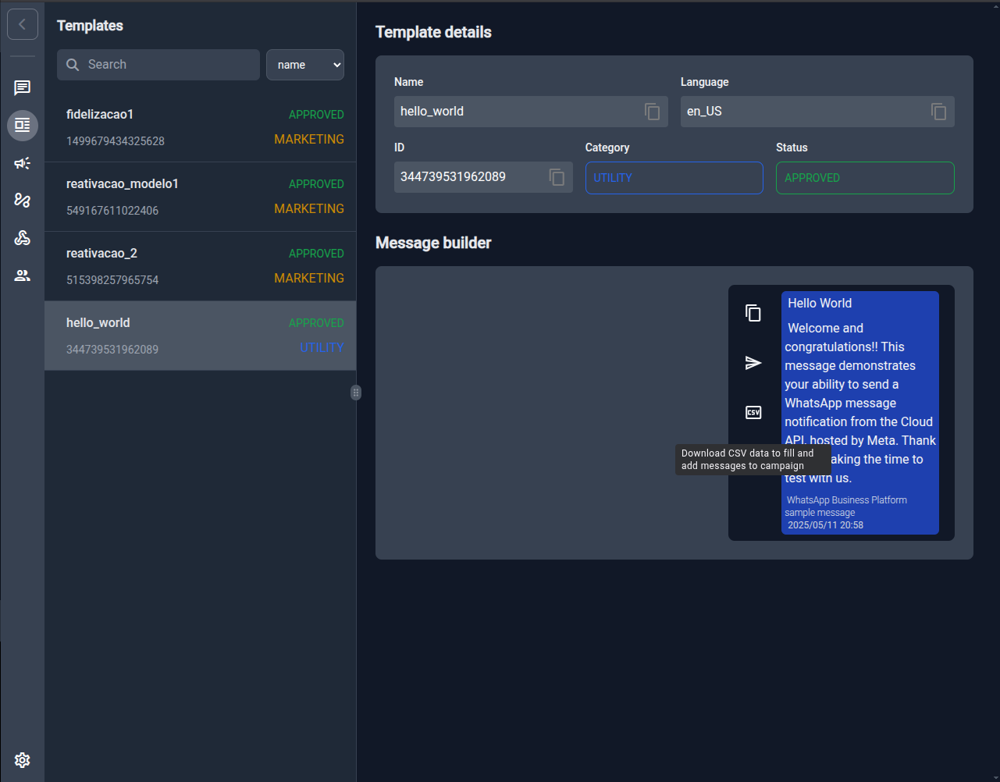

2. A CSV is downloaded with the exact variables required by that template.
   _Fill it_: one row per recipient.

```csv
messaging_product,recipient_type,to,type,template.name,template.language.code,template.components
whatsapp,individual,1111111111,template,hello_world,en_US,[]
whatsapp,individual,2222222222,template,hello_world,en_US,[]
```

3. Go to **Campaigns** and **➕ New Campaign**. Give it a name.

4. In **Add messages to campaign** drag‑and‑drop the CSV or click to upload.

    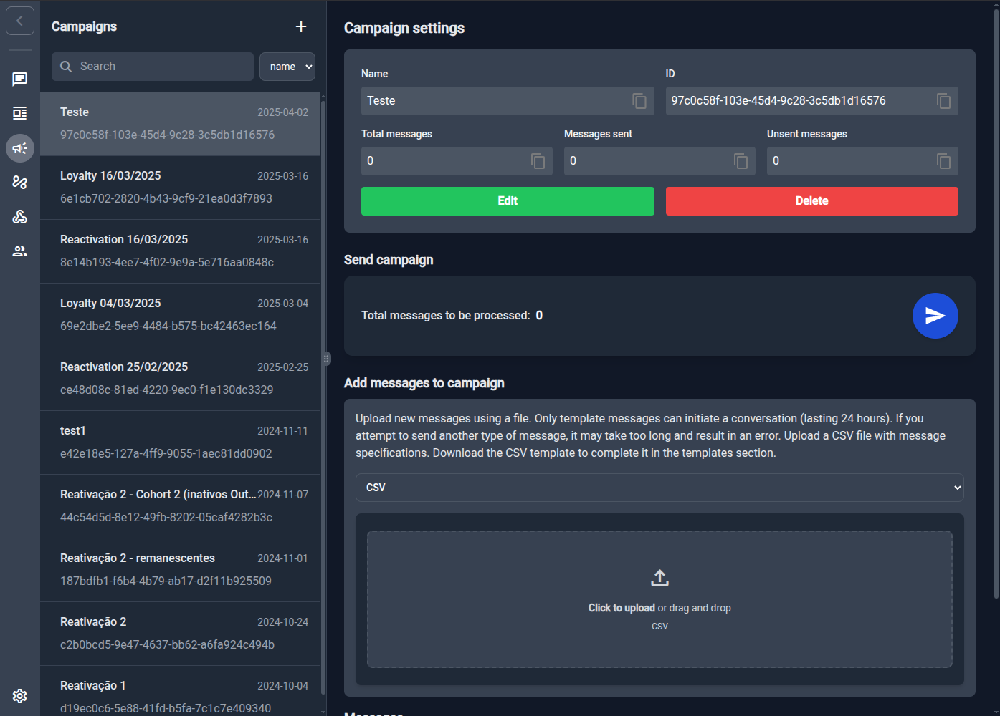

5. Hit the blue **Send ▶️** button. Status updates live. That's it!

See [Campaigns](./campaigns.md) for a full guide.

## 8 — Webhooks & Logs

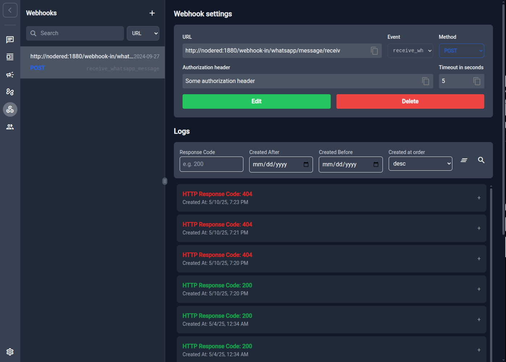

- Register outbound events (e.g. **receive_whatsapp_message**) with URL, timeout, and optional auth header.
- Wire events to **n8n** or any HTTP endpoint.
- Built‑in log viewer with code/filter/search to track success and failures.

## 9 — Billing (`/billing`)

View your current usage against plan limits and subscribe to throughput plans. See [Billing Guide](./billing.md).

## 10 — Power navigation cheatsheet

| Task                      | Shortcut       |
| ------------------------- | -------------- |
| Jump to sidebar item 1‑7  | `1` … `7`      |
| Global search             | `Ctrl Shift F` |
| Focus text input in chat  | `Ctrl Y`       |
| Open **Help / Shortcuts** | `Ctrl /`       |
| Reply to message          | `Ctrl R`       |
| Open message data         | `Ctrl D`       |

> **Shift Esc** closes any modal/dialog instantly.

## 11 — What's next?

- [Workspaces & Permissions](./workspaces.md) — manage team access.
- [Billing](./billing.md) — subscribe to throughput plans.
- [Phone Config](../config/phone-config.md) — add more phone numbers.
- Build CSV campaigns at scale — see [Campaigns](./campaigns.md).

Happy messaging 🚀
