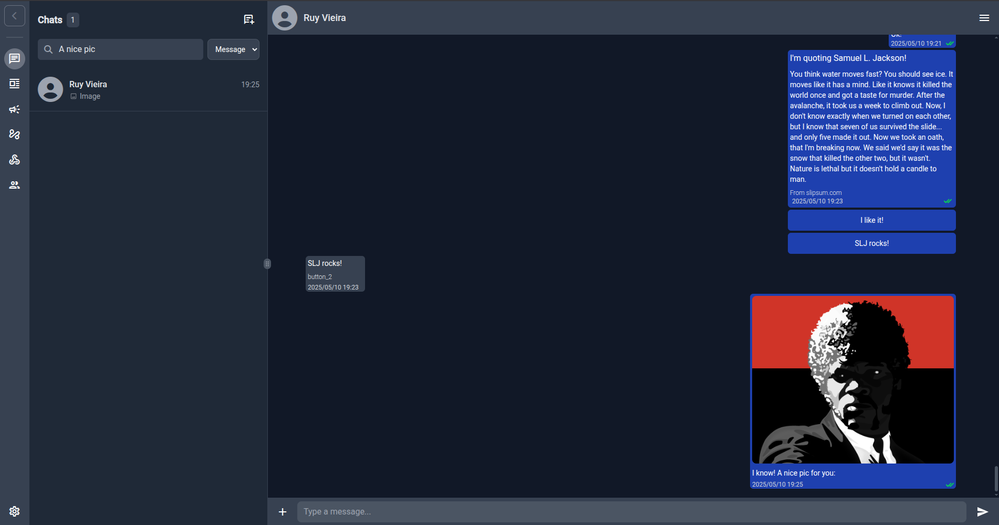

# **wacraft** <small>Build WhatsApp Cloud apps in minutes</small>

> The **fastest way** to give your team an **UI & API** for the official **WhatsApp Cloud API**—powered by Go, Angular and Docker.

## Why wacraft? 🚀

| 🚀 **Feature**            | 💡 **Why it matters**                                                             |
| ------------------------- | --------------------------------------------------------------------------------- |
| 🖥️ **Familiar UI**        | Angular front‑end that feels just like WhatsApp Web—users need **zero** training. |
| ⚙️ **Go‑powered backend** | High‑performance REST + Webhook server engineered for massive scale.              |
| 🔌 **Automation‑ready**   | One‑line integrations with workflow engines like **Node‑RED** or **n8n**.         |
| 🛠️ **Open & extensible**  | MIT‑licensed—fork it, extend it, embed it.                                        |
| ❤️ **Community‑driven**   | Extra features & priority support available via donation plans.                   |

## ✨ Feature Highlights

### 1 — Angular UI

Manage conversations, templates, contacts, webhooks and users in a clean interface. Check the [UI Walkthrough](guide/ui.md) to see how it works!

### 2 — Go API

<https://github.com/Astervia/wacraft-server>
REST & WebSocket endpoints for everything the UI does—perfect for CI/CD and custom integrations. Also includes OpenAPI specs for easy client generation.

### 3 — Real‑time Webhooks

Receive and react to WhatsApp events the **moment** they happen.

### 4 — Automation Tools

Drag‑and‑drop flows for Node‑RED or n8n let non‑devs build chatbots in minutes.

### 5 - And more

Check [Product Overview](guide/overview.md) and [UI Walkthrough](guide/ui.md) for a list of features and how they work.

## 🏁 Getting Started 

1. [**Grab your Meta credentials**](config/meta-setup.md)
2. [**Create/fill your `.env`**](quickstart/local.md#1-prepare-a-minimal-env) (copy the _Minimal Dev_ block)
3. [**Run the local stack**](quickstart/local.md#2-launch-the-stack)
4. [**Setup the WhatsApp Webhooks**](quickstart/local.md#3-expose-an-https-webhook)

> Already have prod infra? Jump directly to the [Fast Production Deploy](quickstart/production.md).

## ☸ Deployment Options 

| Scenario                        | Guide                                                |
| ------------------------------- | ---------------------------------------------------- |
| **Local Dev**                   | [quickstart/local.md](quickstart/local.md)           |
| **Fast Production Deploy**      | [quickstart/production.md](quickstart/production.md) |
| **Production (Docker Compose)** | [deploy/docker-compose.md](deploy/docker-compose.md) |
| **Binary + Vercel Front‑end**   | [deploy/binary-vercel.md](deploy/binary-vercel.md)   |
| **Node‑RED Integration**        | [deploy/node-red.md](deploy/node-red.md)             |

You can also hit [Deploy Overview](deploy/overview.md) to see a full list of deployment options and choose what works best for you.

## 🔑 Configuration Overview

All config happens via **environment variables**. Check [Getting Meta Credentials](config/meta-setup.md) to setup your Meta application and see the [Environment Variables Reference](config/env-vars.md) for the full table.

## 💬 Need help?

- **GitHub Issues** – bug reports & feature requests
- **Unlock new features / Consulting** – [wacraft@astervia.tech](mailto:wacraft@astervia.tech)

---

σΔγ
